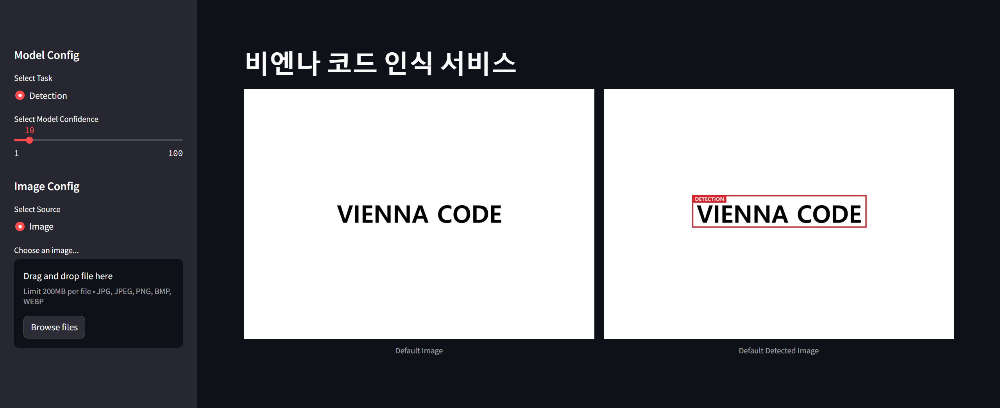

#  👑 Vienna Code Project For Demo👑

## 📰 Streamlit 활용한 데모 페이지

## ⚙ 사용환경
<!--  -->
 

## 🛠 사용기술
  

## 📅 기간
2023.12.26 ~ 2024.02.08

## 🔔 컨벤션 규칙

### 주로 사용하는 태그

- **Feat** : 새로운 기능을 추가하는 경우
- **Fix** : 버그를 고친경우
- **Docs** : 문서를 수정한 경우
- **Style** : 코드 포맷 변경, 세미콜론 누락, 코드 수정이 없는경우
- **Refactor** : 코드 리펙토링
- **Test** : 테스트 코드. 리펙토링 테스트 코드를 추가했을 때
- **Chore** : 빌드 업무 수정, 패키지 매니저 수정
- **Design** : CSS 등 사용자가 UI 디자인을 변경했을 때
- **Rename** : 파일명(or 폴더명) 을 수정한 경우
- **Remove** : 코드(파일) 의 삭제가 있을 때. "Clean", "Eliminate" 를 사용하기도 함

### 기타 태그 타입들(참고)

- **Add** : 코드나 테스트, 예제, 문서등의 추가 생성이 있는경우 
- **Improve** : 향상이 있는 경우. 호환성, 검증 기능, 접근성 등이 될수 있습니다.
- **Implement** : 코드가 추가된 정도보다 더 주목할만한 구현체를 완성시켰을 때
- **Move** : 코드의 이동이 있는경우
- **Updated** : 계정이나 버전 업데이트가 있을 때 사용. 주로 코드보다는 문서나, 리소스, 라이브러리등에 사용합니다.
- **Comment** : 필요한 주석 추가 및 변경

## 팀원
| 이름        | Connect To                           |
|--------------|------------------------------------------|
| 이현희      | [ardor924@gmail.com](mailto:ardor924@gmail.com)  |
| 강재성      | [kg9884@naver.com](mailto:kg9884@naver.com) |
| 이도형      | [ldlxxlbl@gmail.com](mailto:ldlxxlbl@gmail.com) |
| 정재훈      | [jjh5720@gmail.com](mailto:jjh5720@gmail.com) |

## References
[YOLOv8 Predict 문서](https://docs.ultralytics.com/ko/modes/predict/)  
[Streamlit YOLOv8 깃허브](https://github.com/CodingMantras/yolov8-streamlit-detection-tracking)